# AIR-NOTICE-BLUE-LINK-SECURE-WIRELESS-DISPLAY-SYSTEM-
📢 AIRNOTICE BLUELINK – SECURE WIRELESS DISPLAY SYSTEM

📌 Project Overview

AirNotice BlueLink – Secure Wireless Display System is a modern electronic notice board designed as an alternative to traditional notice boards.

The system allows an authorized user to send a notice from an Android smartphone through Bluetooth. The HC-05 Bluetooth module receives the message and sends it to the LPC2148 ARM7 microcontroller.

The microcontroller verifies the predefined security passkey, extracts the actual notice message, stores the message in AT25LC512 EEPROM, and displays it on four 8×8 dot-matrix LED displays with a scrolling effect.

This system can be useful in:

- 🏫 Schools and Colleges
- 🏢 Offices
- 🏭 Industries
- 🏥 Public information areas
- 📢 Announcement systems

---

🎯 Aim

To develop a secure wireless electronic notice board that receives messages through Bluetooth, verifies an authorized passkey, stores the message in EEPROM, and displays the message on a scrolling dot-matrix LED display.

---

⭐ Key Features

- 📱 Android smartphone-based message transmission
- 📶 Wireless communication using Bluetooth
- 🔐 Passkey-based message authentication
- 🧠 LPC2148 ARM7 microcontroller
- 💾 AT25LC512 EEPROM for message storage
- 🔢 Four 8×8 dot-matrix LED displays
- 🔄 Scrolling text display
- ⚡ UART-based communication
- 🔌 74HC164 shift registers for column control
- 🔲 74HC573 latch for row control
- ⏳ Displays "Waiting for message" when no message is stored

---

🏗️ System Block Diagram

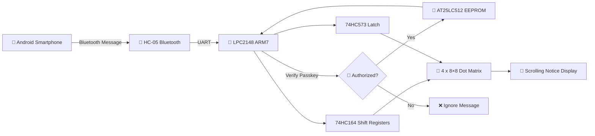

🔄 Working Principle

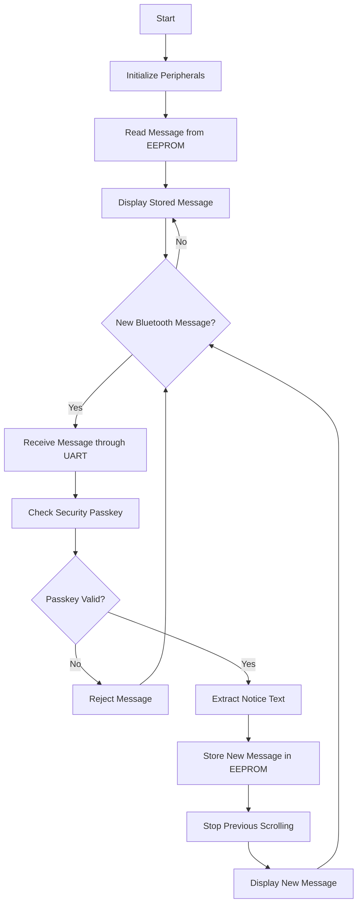
---

🔐 Security Mechanism

The system does not directly display every message received through Bluetooth.

The sender must provide a predefined passkey/security code along with the message.

Example

Input received from Bluetooth:

$$789Vector India$$

The LPC2148 verifies the passkey and extracts:

Vector India

Only the extracted authorized message is displayed on the dot-matrix LED.

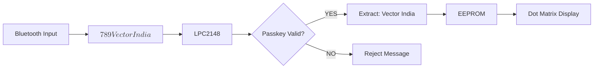
---

🧰 Hardware Requirements

| Component | Purpose |
|---|---|
| LPC2148 | Main ARM7 microcontroller |
| 4 × 8×8 Dot Matrix Displays | Displays scrolling notice |
| 74HC164 | Serial-in parallel-out shift register for column control |
| 74HC573 | Octal D-type latch for row control |
| AT25LC512 EEPROM | Stores notice messages |
| HC-05 Bluetooth Module | Wireless communication |
| DB-9 Cable / USB-UART Converter | UART/PC interface |

💻 Software Requirements

- Embedded C
- Keil C Compiler
- Flash Magic
- Android Bluetooth Terminal application

The original project documentation specifies Keil C Compiler, Embedded C and Flash Magic.

---

🔌 Hardware Connections

### LPC2148 UART / Bluetooth Connection

| LPC2148 Pin | Connected Module |
|---|---|
| P0.0 / TxD0 | HC-05 Rx |
| P0.1 / RxD0 | HC-05 Tx |
---

### 74HC573 – Dot Matrix Row Control

The 74HC573 latch is used to control the dot-matrix row data.

| 74HC573 Data Pin | LPC2148 |
|---|---|
| D0 | P0.16 |
| D1 | P0.17 |
| D2 | P0.18 |
| D3 | P0.19 |
| D4 | P0.20 |
| D5 | P0.21 |
| D6 | P0.22 |
| D7 | P0.23 |

The 74HC573 outputs are connected to the row lines of the dot-matrix displays.
---
### AT25LC512 EEPROM – SPI Connection

| AT25LC512 Signal | LPC2148 |
|---|---|
| SCK | P0.4 |
| MISO | P0.5 |
| MOSI | P0.6 |
| CS | P0.7 |
---
### 74HC164 – Dot Matrix Column Control

| Display | SIN Pin | CP Pin |
|---|---|---|
| Display 1 | P0.8 | P0.9 |
| Display 2 | P0.10 | P0.11 |
| Display 3 | P0.12 | P0.13 |
| Display 4 | P0.14 | P0.15 |


### Actual Hardware Connections
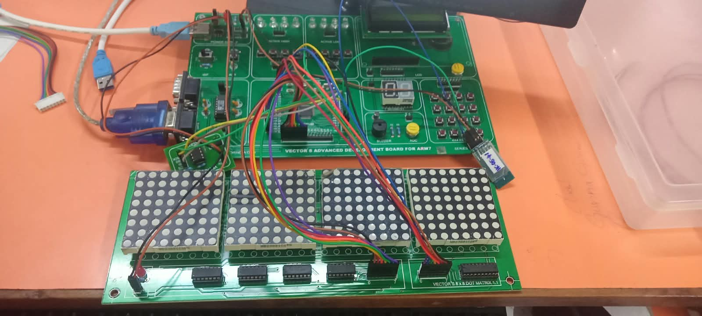

---

🧩 System Architecture

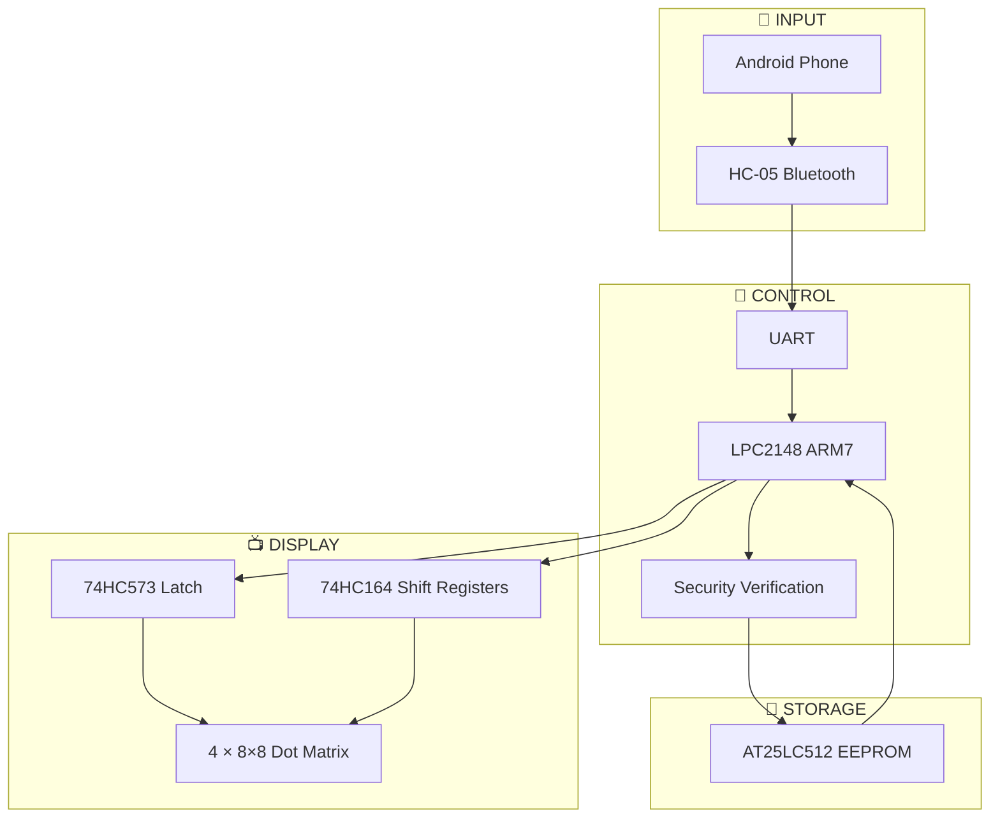
---


📲 Message Communication

The communication process is:

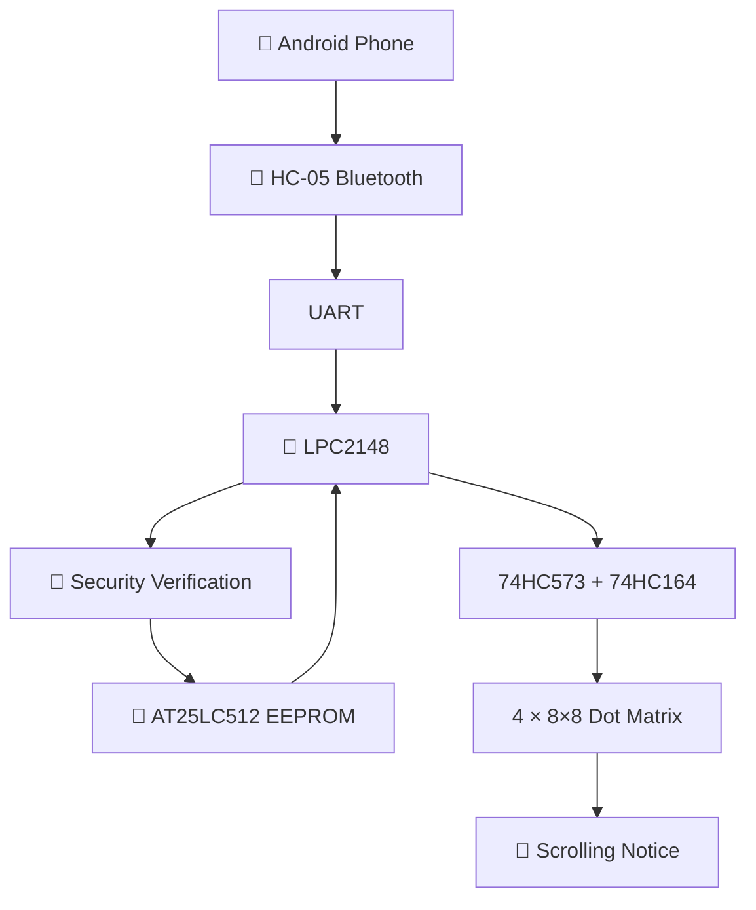
---

💾 EEPROM Operation

The AT25LC512 EEPROM is used to store the latest notice message.

The project implementation includes:

1. Writing bytes to EEPROM
2. Reading bytes from EEPROM
3. Storing a user-defined string
4. Reading the stored string
5. Displaying the stored string on the dot-matrix LED

The project documentation specifies byte/page write and read operations for EEPROM.
### EEPROM Write and Read Operations

The AT25LC512 EEPROM is accessed through SPI communication.

The project implementation supports:

- Byte write using `ByteWrite_25LC512()`
- Byte read using `ByteRead_25LC512()`
- Page write using `PageWrite_25LC512()`
- Write Enable (WREN) before write operations
- Write Disable (WRDI) after write operations

---

📡 Bluetooth Communication

The HC-05 Bluetooth module is used for wireless communication between the Android phone and LPC2148.

Communication Flow

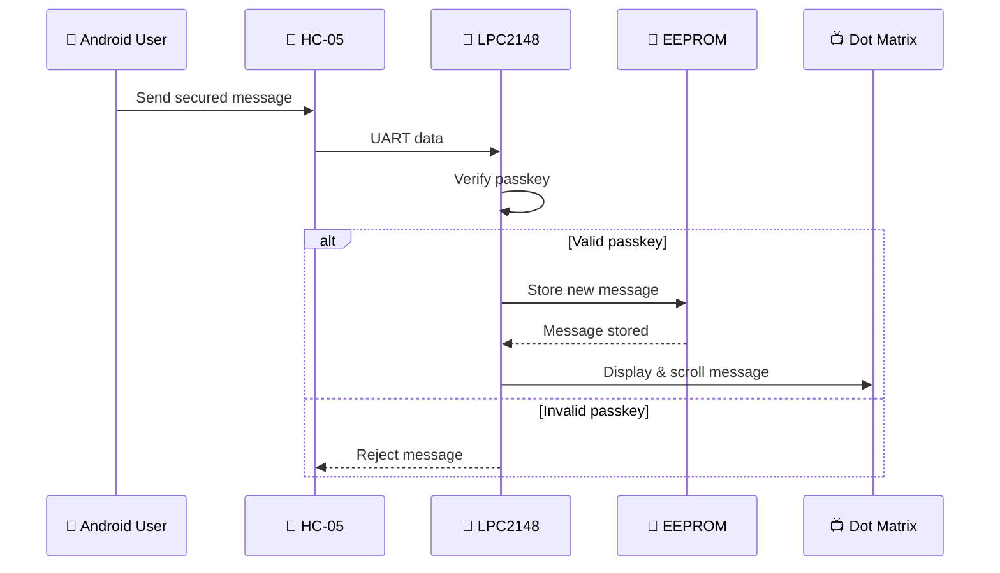

📺 Display Operation

The system uses four 8×8 dot-matrix displays to create a larger scrolling display area.

### Power ON
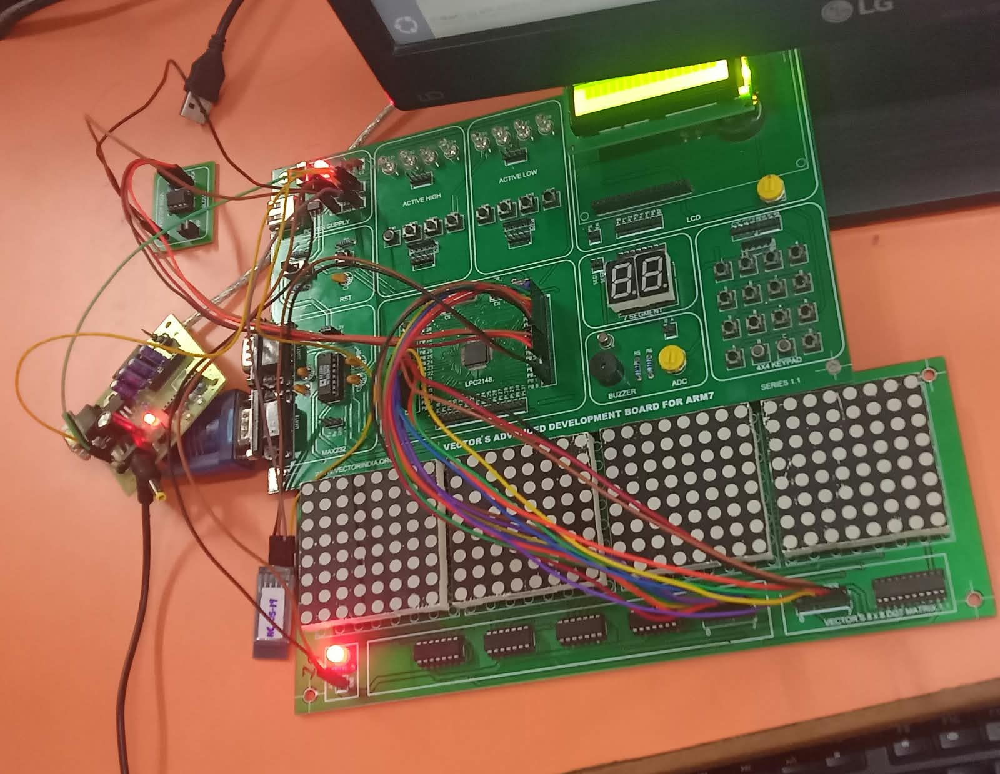

The display is controlled using:

- 74HC164 → Column control
- 74HC573 → Row control
- LPC2148 → Main display control

### Initial Display Output – HELP
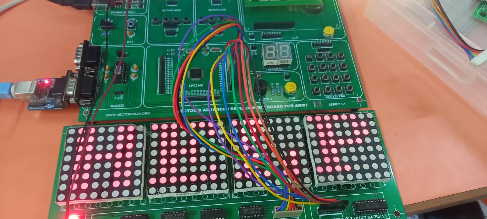

Example:

```text
+--------+--------+--------+--------+
|  8×8   |  8×8   |  8×8   |  8×8   |
| Matrix | Matrix | Matrix | Matrix |
+--------+--------+--------+--------+

        ← SCROLLING MESSAGE →

```

### Scrolling Message Output
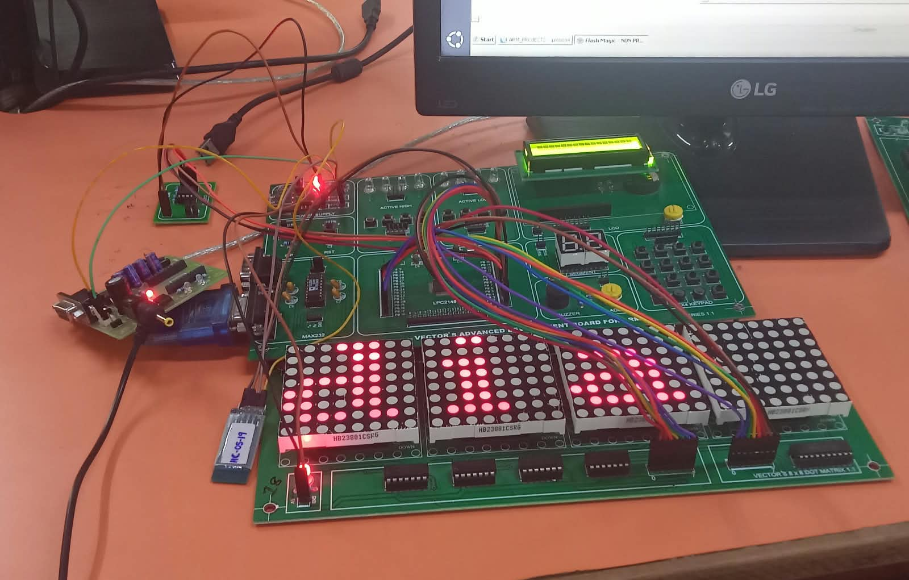

---

🔁 Message Update Logic

The LPC2148 continuously checks for a new Bluetooth message.

When a new authorized message is received:

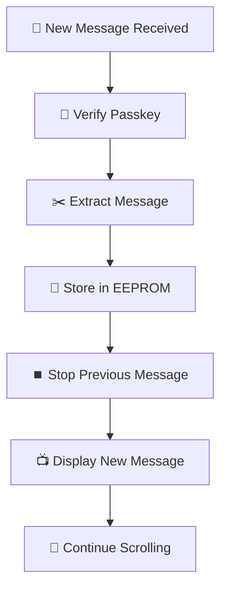
---
### Step 8 – Complete Integration

The final system integrates all major modules:

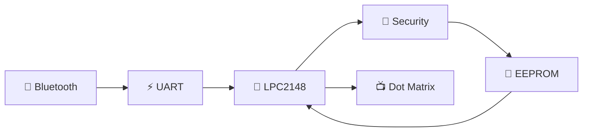
---

⏳ Default Display

If there is no message stored in EEPROM, the system displays:

WAITING FOR MESSAGE

A message-status memory location is used to identify whether a valid message is available.

---

🧪 Implementation Steps

The project was designed to be implemented in stages:

Step 1 – Single Character

Display one character on a single dot-matrix LED.

Step 2 – Four Character Display

Display a four-character string.

Example:

HELP

Step 3 – Scrolling Text

Display a string containing more than 10 characters.

Example:

PROJECT SUCCESSFULLY COMPLETED

Step 4 – EEPROM

Write and read data from EEPROM.

Step 5 – EEPROM String

Store and retrieve a user-defined string.

Step 6 – UART

Test:

- Character transmission
- String transmission
- String reception
- UART interrupt

Step 7 – Bluetooth

Pair the Android phone with HC-05 and send data wirelessly.


The staged implementation sequence is based directly on the supplied project documentation.

---

🛠️ Project Workflow

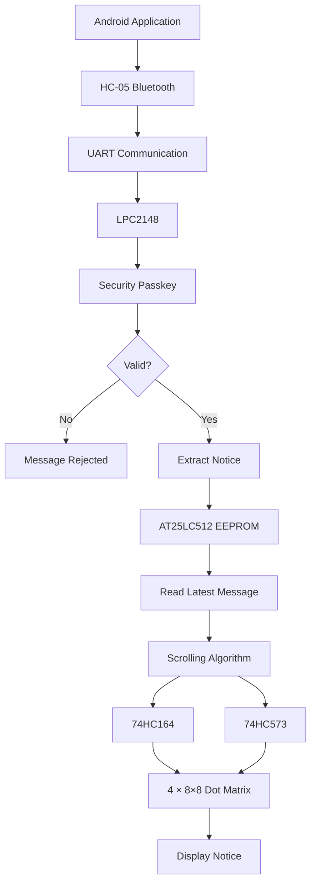
---
### Project Demo Video

[▶️ Watch Project Demo](project_demo.mp4)

---

📁 Suggested GitHub Folder Structure

```text
AIRNOTICE-BLUELINK-SECURE-WIRELESS-DISPLAY-SYSTEM/
│
├── README.md
│
├── Source_Code/
│   ├── main.c
│   ├── mainspi.c
│   ├── 74LS164.c
│   ├── 74LS164.h
│   ├── defines.h
│   ├── delay.c
│   ├── delay.h
│   ├── delays.c
│   ├── delays.h
│   ├── dml.c
│   ├── dml.h
│   ├── lcd.c
│   ├── lcd.h
│   ├── spi.c
│   ├── spi.h
│   ├── spi_defines.h
│   ├── spi_eeprom.c
│   ├── spi_eeprom.h
│   ├── spi_eeprom_defines.h
│   ├── UART_INT.c
│   ├── types.h
│   └── startup.s
│
└── project_demo.mp4
```
---

📌 Applications

- 🏫 College Notice Boards
- 🏢 Office Announcements
- 🏭 Industrial Information Display
- 🏥 Hospital Announcements
- 🚉 Public Information Systems
- 📢 Event Announcements
- 🏫 School Communication Systems

---

🚀 Future Enhancements

Possible future improvements include:

- Wi-Fi-based communication
- IoT cloud integration
- Web-based notice management
- Mobile application with login authentication
- Multiple display-board support
- Remote monitoring
- Admin dashboard
- Real-time message scheduling

---

👩‍💻 Technologies Used

```text
Microcontroller : LPC2148 ARM7
Programming     : Embedded C
Compiler        : Keil C
Communication   : Bluetooth / UART
Bluetooth       : HC-05
Memory          : AT25LC512 EEPROM
Display         : 8×8 Dot Matrix LED
Shift Register  : 74HC164
Latch           : 74HC573
Programming Tool: Flash Magic
```
---

🎓 Project Type

Academic / Embedded Systems Project

Domain

Embedded Systems | ARM7 | Bluetooth Communication | LED Display

---

📜 Conclusion

AirNotice BlueLink provides a secure and convenient method for displaying electronic notices wirelessly.

By combining LPC2148, HC-05 Bluetooth, UART, AT25LC512 EEPROM, 74HC164, 74HC573 and dot-matrix LED displays, the system can receive, authenticate, store and display messages without requiring a traditional manually updated notice board.

The security passkey ensures that only authorized messages are displayed on the electronic notice board.

---

⭐ Project Highlights

```text
📱 Wireless Message
       ↓
📶 Bluetooth
       ↓
🧠 LPC2148
       ↓
🔐 Security Verification
       ↓
💾 EEPROM Storage
       ↓
🔄 Scrolling
       ↓
📺 Dot Matrix Display
```

«Secure • Wireless • Flexible • Real-Time Electronic Notice Display»
